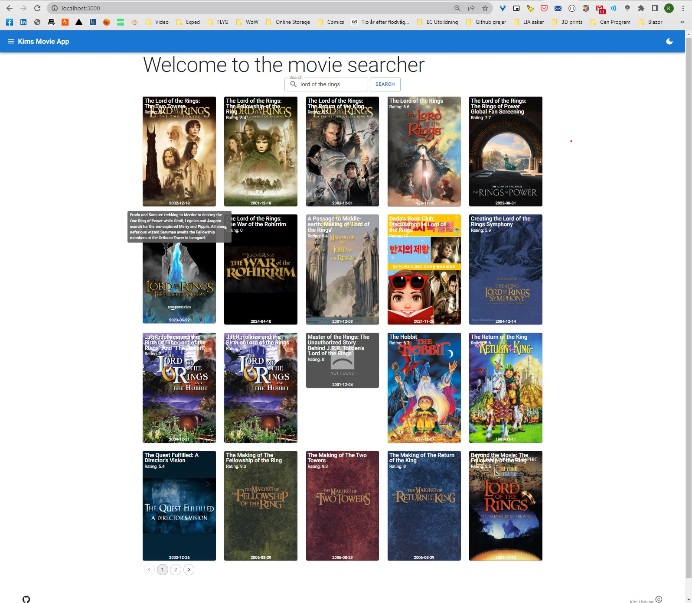
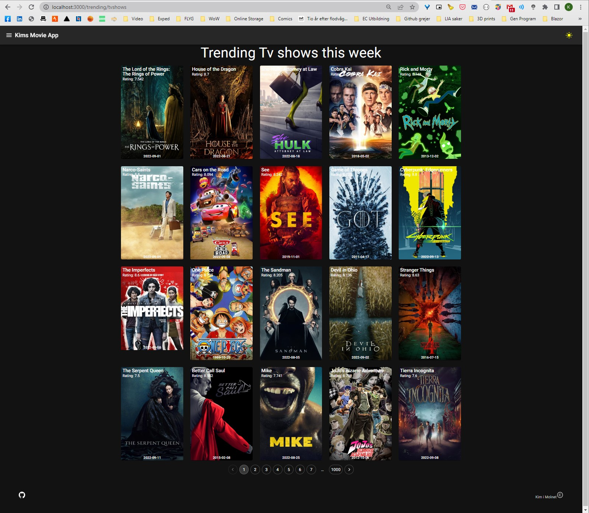
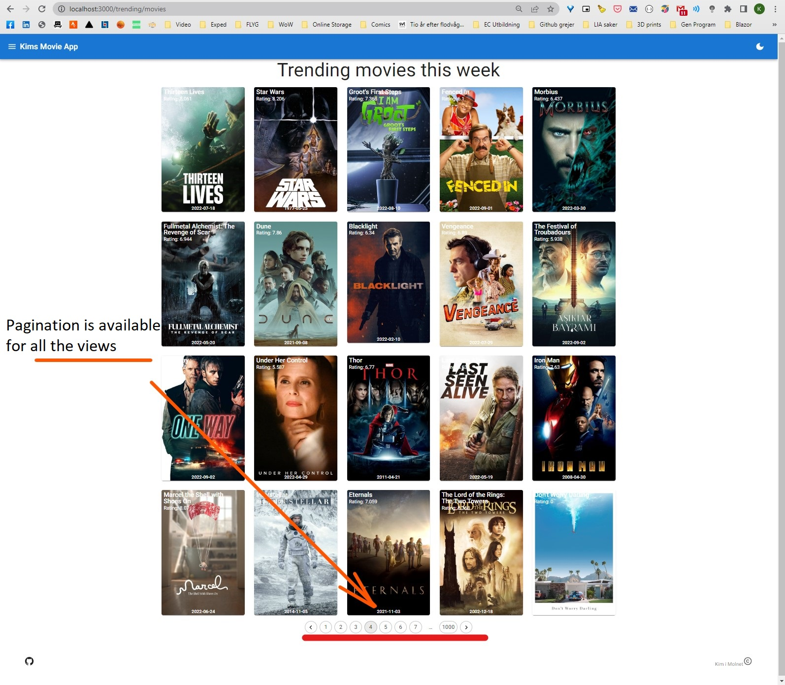

# Kims inlämning REACT

## Movie and Tv show app

In this application you can search for movies by name on the front page. You can also see the trending movies and tv shows in two other pages. I've used an API to get the data and I've also been using MUI to help me build the look of the application.

## Navigation

### Home

- '/' (Home - This is where you can search for movies by name)

If you hover over a movie you will be able to see the summary of the movie

### Trending movies

- '/trending/movies (Trending movies this week)
  

You are able to change to darkmode in the upper right corner. This state is persistent if you go to another view. 

### Trending tv shows

- '/trending/tvshows (Trending tv shows this week)

There is pagination on all views that load the next 20 movies/tv shows in the search. 
